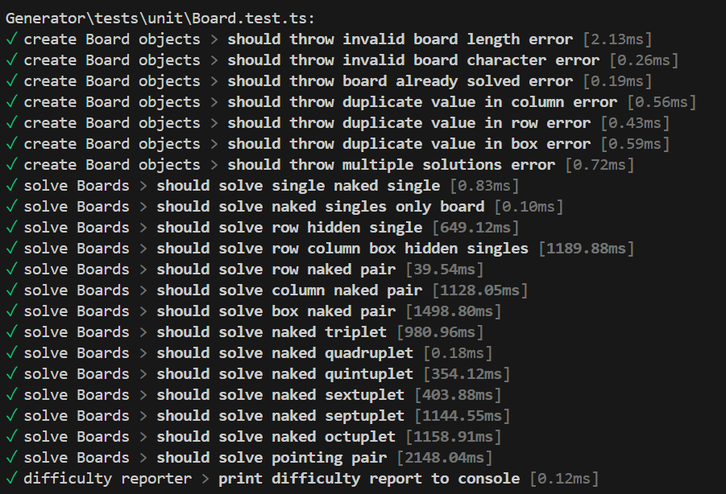
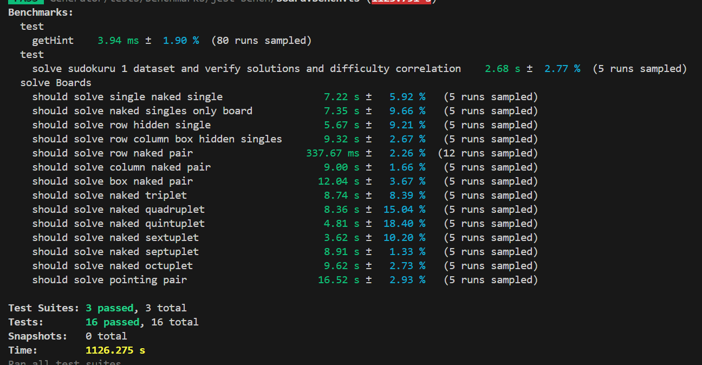
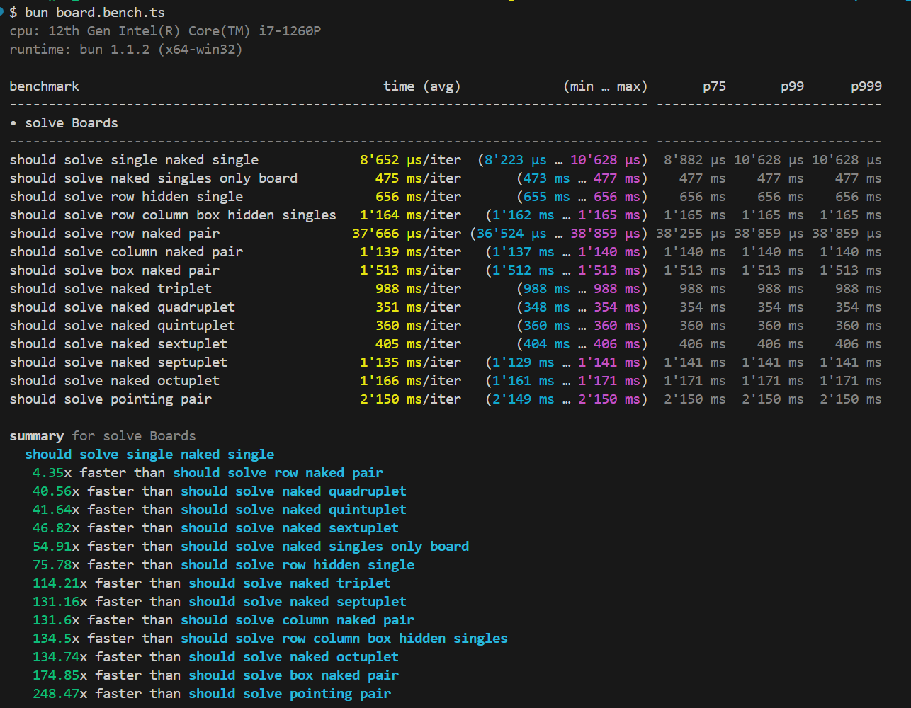
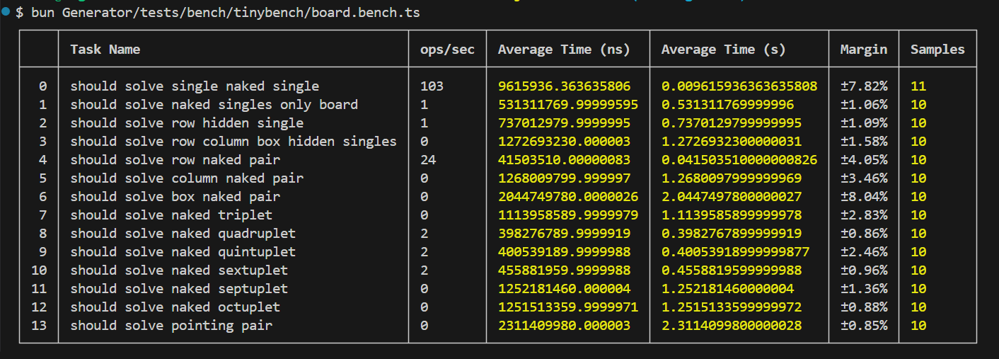
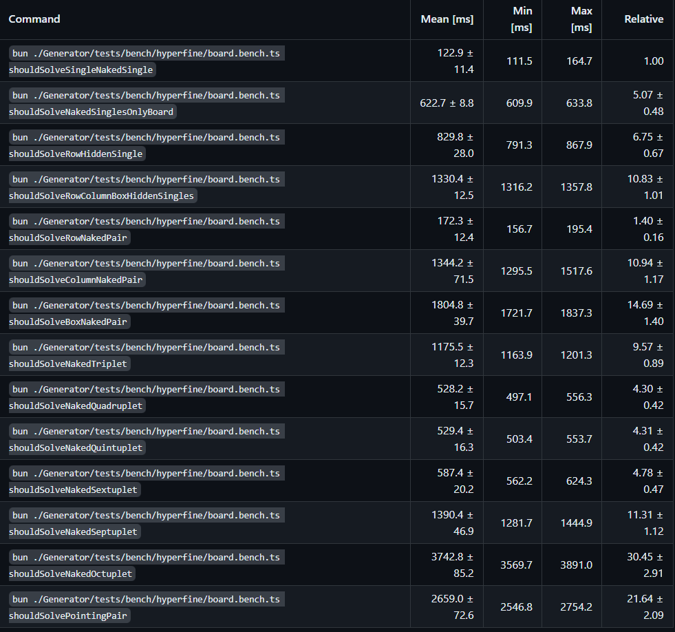

# jest / bun

This is for the baseline.

# jest-bench

Run Command: `test:jest-bench`

Results:

# mitata

Run Command: `bun Generator/tests/bench/mitata/board.bench.ts`

Run Command: `bun Generator/tests/bench/mitata/difficulty.bench.ts`

Run Command: `bun Generator/tests/bench/mitata/sudoku.bench.ts`

Results:

# tinybench

Run Command: `bun Generator/tests/bench/tinybench/board.bench.ts`

Run Command: `bun Generator/tests/bench/tinybench/difficulty.bench.ts`

Run Command: `bun Generator/tests/bench/tinybench/sudoku.bench.ts`

# hyperfine

Install hyperfine: https://github.com/sharkdp/hyperfine
Run Command: `hyperfine --warmup 3 'bun ./Generator/tests/bench/hyperfine/board.bench.ts shouldSolveSingleNakedSingle'`

Run Command: `hyperfine --warmup 3 --show-output --parameter-list function shouldSolveSingleNakedSingle,shouldSolveNakedSinglesOnlyBoard,shouldSolveRowHiddenSingle,shouldSolveRowColumnBoxHiddenSingles,shouldSolveRowNakedPair,shouldSolveColumnNakedPair,shouldSolveBoxNakedPair,shouldSolveNakedTriplet,shouldSolveNakedQuadruplet,shouldSolveNakedQuintuplet,shouldSolveNakedSextuplet,shouldSolveNakedSeptuplet,shouldSolveNakedOctuplet,shouldSolvePointingPair --export-markdown benchmarks/hyperfine-results.md 'bun ./Generator/tests/bench/hyperfine/board.bench.ts {function}'`
hyperfine --prepare 'make clean' --parameter-scan num_threads 1 12 'make -j {num_threads}'

