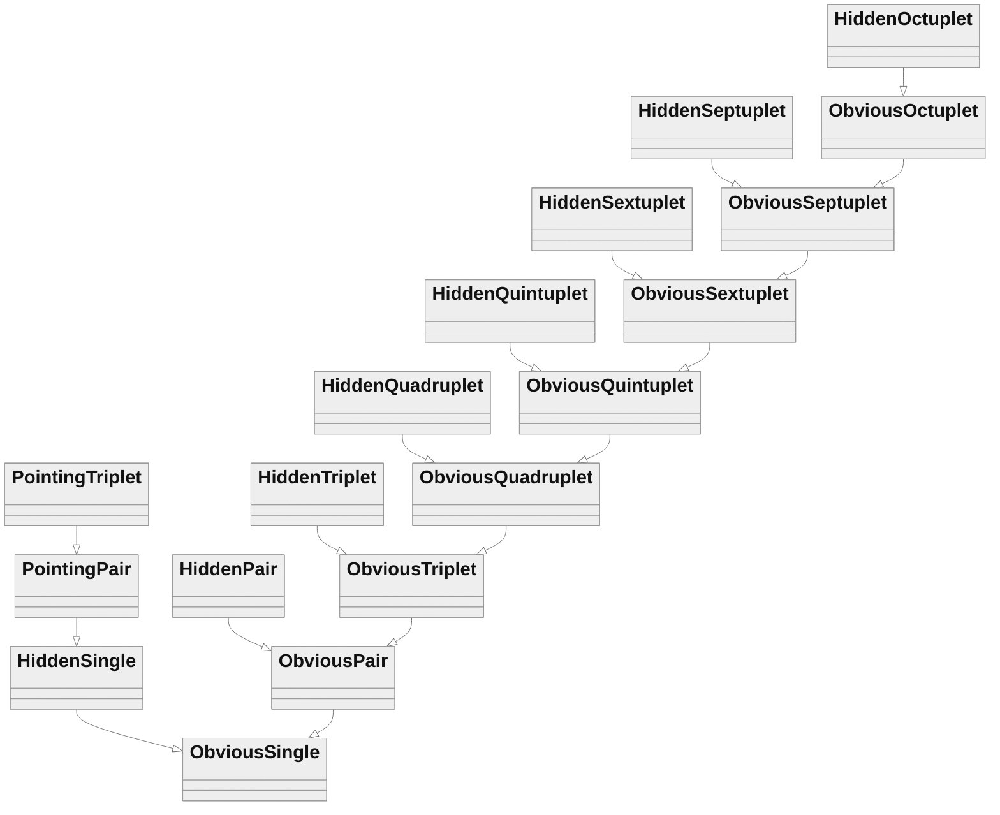

# Strategy Prerequisite Chart
If you place certain values you can reduce one strategy to another. This chart documents those relations. 
For instance, if you place values in the same row, column, and/or box as a hidden single such that it's left with only one possibility you have reduced it to a obvious single. 
Relations are transitive meaning obvious octuplet can become septuplet then sextuplet. 
They can also skip steps in some cases.

