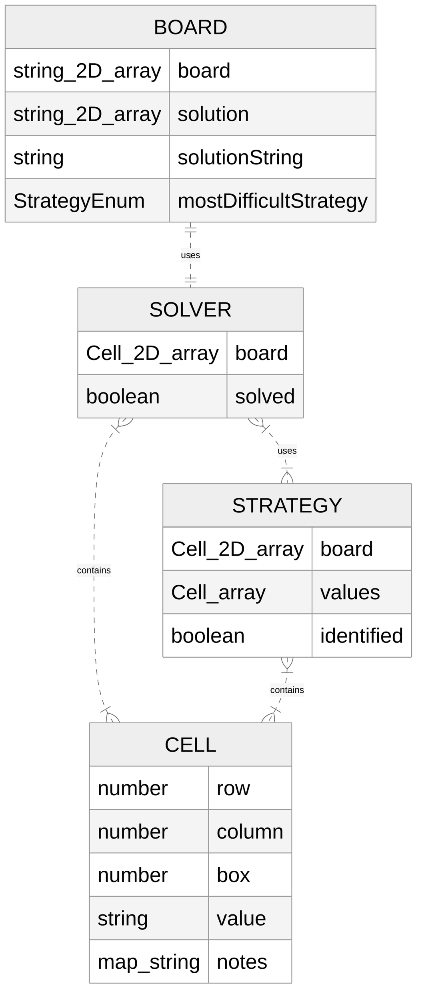

# Setup Instructions:
Run npm i<br>
test using npm test<br>
update docs with npm run update-docs

Run demo using npm start and then opening demo.html

### How to upload puzzles from inputPuzzles.txt file

If we have a puzzle file like inputPuzzles.txt we can use that to upload puzzles to the database.<br>

The command to generate the puzzles is ```npm run generate --filepath=inputPuzzles.txt```<br>
Optional parameters can be run with:<br> ```npm run generate --filepath=inputPuzzles.txt --start=2 --end=4 --batchsize=100```<br>
- filepath: Required, file of puzzles (only integers, newline indicates new puzzle)<br>
- start: Optional, indicates what puzzle should be the start puzzle of the file (1 indexed, inclusive)<br> For example ```--start=2``` skips the first puzzle in input file.<br>
- end: Optional, indicates what puzzle should be the end puzzle of the file. (1 indexed, inclusive)<br> For example ```--end=2``` means that the second puzzle is the last input puzzle.<br>
- batchsize: Optional, indicates how many puzzles are sent in a single request. If the input values are larger than the batch size, multiple requests will be sent.<br>

Upload generated json puzzle arrays file using ```npm run upload --endpoint=ENDPOINT```<br>
e.g. ENDPOINT = http://localhost:3000/api/v1/puzzles/ i.e. any POST endpoint URL that's expecting JSON body that looks like the following example:<br>
```json
[  
  {  
    "puzzle": 310084002200150006570003010423708095760030000009562030050006070007000900000001500,  
    "puzzleSolution": 316984752298157346574623819423718695765439128189562437851396274637245981942871563,  
    "strategies": [ "NAKED_SINGLE", "HIDDEN_SINGLE", "NAKED_PAIR", "NAKED_TRIPLET" ],  
    "difficulty": 44,   
    "drillStrategies": [ "HIDDEN_SINGLE", "NAKED_SEXTUPLET" ]  
  },  
  {  
    "puzzle": "603002001500000020901730006810400090060000000000690040350000004002070005000500108",  
    "puzzleSolution": 683942751574816329921735486817453692469287513235691847358169274142378965796524138,  
    "strategies": [  
      "NAKED_SINGLE",  
      "HIDDEN_SINGLE",  
      "NAKED_PAIR",  
      "NAKED_TRIPLET",  
      "NAKED_QUADRUPLET" 
    ],  
    "difficulty": 60,  
    "drillStrategies": [ "HIDDEN_SINGLE", "NAKED_SEPTUPLET" ]  
  }
]
```

Will do one POST request per array in puzzles.txt<br>

## Documentation
Documentation is auto-generated using Typedoc and hosted on GitHub pages here:<br>
https://sudokuru.github.io/SudokuPuzzleGenerator/

