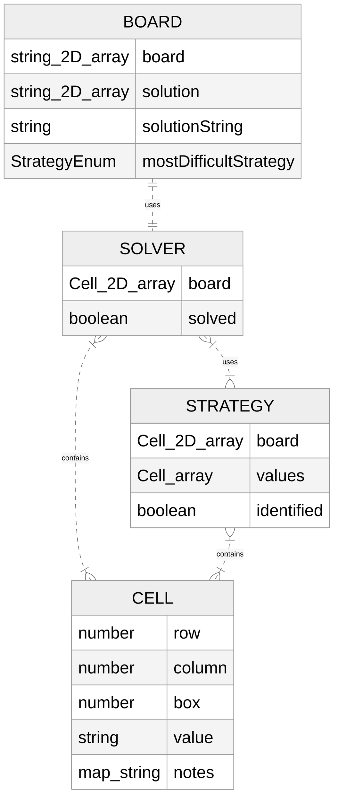

# Setup Instructions:
Run npm i 
test using npm test 
update docs with npm run update-docs

Run demo using npm start and then opening demo.html

## Documentation
Documentation is auto-generated using Typedoc and hosted on GitHub pages here: 
https://sudokuru.github.io/SudokuPuzzleGenerator/

