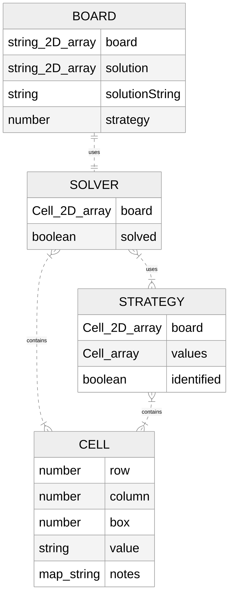

Setup Instructions:
Change version of typescript in package.json to 4.8.4
Run npm i
Reset package.json (run git checkout -- package.json)
Run npm i
Should be able to run npm test successfully now

test using npm test
update docs with npm run update-docs

