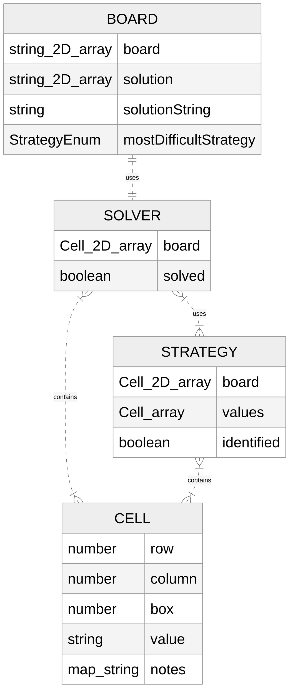

# Setup Instructions:
Run npm i 
test using npm test 
update docs with npm run update-docs

Run demo using npm start and then opening demo.html

Generate file containing array of puzzle JSON objects using npm run generate FILEPATH
e.g. FILEPATH = file.txt if file.txt is in the same directory as this file and contains puzzle strings.
Can also use optional start parameter e.g. npm run generate file.txt 2 will start at the 2nd puzzle (skips the 1st puzzle)
Can use optional start and end parameters e.g. npm rum generate file.txt 2 4 will run on 2nd, 3rd, and 4th puzzles.
Start and end are both 1 indexed and inclusive e.g. 2 2 will run on just the 2nd puzzle.
Finally optional batch size which determines how many puzzles put in each array (one array per line).
e.g. npm run generate file.txt 2 4 2 which place 2nd and 3rd puzzles in array on line 1 and 4th puzzle on array in second line.

## Documentation
Documentation is auto-generated using Typedoc and hosted on GitHub pages here: 
https://sudokuru.github.io/SudokuPuzzleGenerator/

