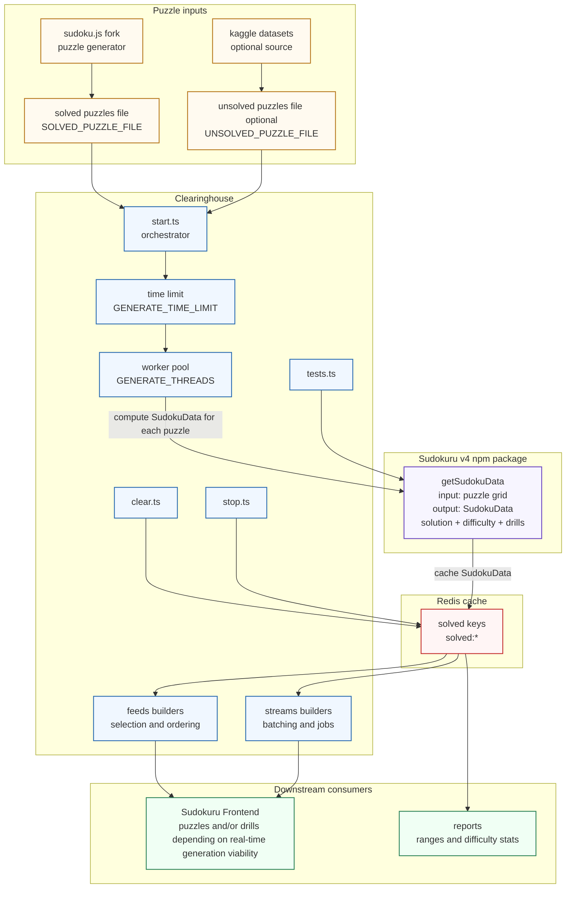

# Sudokuru 4.0 Rebuild Plan Revision 1.0

## TL;DR

Rebuild the `Sudokuru` package (v4.0) as a **modular, functional, immutable** Sudoku engine with:

* A clearer, typed API for the Frontend (shared types via `Types.ts`)
* A **hint schema** that Frontend can render as **stages**
* Separation of **hint generation** vs **hint application**
* A simpler, replaceable “vision/queue” mechanism for strategy scanning
* A roadmap that delivers value incrementally (docs-first + TDD strategy examples)

## Changelog

* None so far, it must be a perfect plan :)

---

## Project Links

* Current Sudokuru API:

  * [Sudokuru/Sudokuru/lib/Api.ts](https://github.com/Sudokuru/Sudokuru/blob/ec9f4ae7ac82d458e4cb2c3fba99b40a322a546c/lib/Api.ts)
  * [Sudokuru/Sudokuru/lib/Hint.ts](https://github.com/Sudokuru/Sudokuru/blob/ec9f4ae7ac82d458e4cb2c3fba99b40a322a546c/lib/Hint.ts)
  * [Sudokuru/Sudokuru/lib/PuzzleData.ts](https://github.com/Sudokuru/Sudokuru/blob/ec9f4ae7ac82d458e4cb2c3fba99b40a322a546c/lib/PuzzleData.ts)
  * [Sudokuru/Sudokuru/lib/Drill.ts](https://github.com/Sudokuru/Sudokuru/blob/ec9f4ae7ac82d458e4cb2c3fba99b40a322a546c/lib/Drill.ts)
* Frontend types reference:

  * [Sudokuru/Frontend/sudokuru/app/Api/Puzzle.Types.ts](https://github.com/Sudokuru/Frontend/blob/6278302400a02ec9dd0e56301d0e059f17128f20/sudokuru/app/Api/Puzzle.Types.ts)

---

## Motivation & Goals

### Why rewrite (and how we’ll measure success)

**Primary goals**

1. **Add/extend strategies cleanly** (no stateful coupling).
2. **Fix drills** by making strategy outputs more rigorous + reproducible.
3. **Improve performance** enough for real-time puzzle generation / repeated hinting.
4. **Interop with Frontend**: export types + return hints as structured stages the UI can render.
5. **Better documentation** (including Frontend screenshots + concrete strategy examples).

**Non-goals**

* Not fixing every legacy problem immediately.
* Not implementing every advanced strategy before shipping 4.0.
* Not building a huge toggleable UI feature set initially (keep scope tight).

### Migration intent

A “simple” migration path from Sudokuru `3.4 → 4.0`, focused on making the system **expandable/flexible/maintainable** so future improvements don’t require another rewrite.

---

## Terminology (Consistency Rules)

| Term       | Use it when…                                  | Examples                                         |
| ---------- | --------------------------------------------- | ------------------------------------------------ |
| **Sudoku** | high-level puzzle object and related metadata | `SudokuObjectProps`, `SudokuData`, `SudokuDrill` |
| **Game**   | player-session state/metrics/actions          | `GameStatistics`, `GameAction(s)`                |
| **Puzzle** | the grid itself                               | `CellProps[][]`                                  |

---

## Design Principles

1. **Modularization**
   Everything is in independently usable modules with their own tests.

2. **Functional programming**

   * Inputs are treated as immutable.
   * Prefer pure functions with explicit inputs/outputs.

3. **Deterministic + idempotent**
   Same inputs ⇒ same outputs (no hidden caches / randomness).

4. **No OOP as the organizing paradigm**
   Organize into function modules, not stateful classes.

5. **Hint generation is separate from hint application**
   Strategies output *what to do*; applicator performs the update.

6. **Strategy modules are easy to test**
   Strategy modules: `board + context → Hint | null`.

7. **Docs-first strategy development**
   Each strategy starts as:

   * documented examples (TDD fixtures)
   * Frontend-renderable staged hints
   * team sign-off on expected outputs
     before implementing logic.

---

## Package Surface Area

### `Types.ts` (public API types)

`Types.ts` exports types used by the API. Some are re-exported from internal modules so Frontend can depend on stable public types without importing internals.

**Existing Frontend sources (for reference mapping)**

* `CellType`, `SUDOKU_CELL_TYPES`:
  [Sudokuru/Frontend/sudokuru/app/Functions/LocalDatabase.ts#L144](https://github.com/Sudokuru/Frontend/blob/6278302400a02ec9dd0e56301d0e059f17128f20/sudokuru/app/Functions/LocalDatabase.ts#L144)
  [Sudokuru/Frontend/sudokuru/app/Functions/LocalDatabase.ts#L146](https://github.com/Sudokuru/Frontend/blob/6278302400a02ec9dd0e56301d0e059f17128f20/sudokuru/app/Functions/LocalDatabase.ts#L146)
* `CellProps`, `CellWithValue`, `CellWithNotes`:
  [Sudokuru/Frontend/sudokuru/app/Functions/LocalDatabase.ts#L132-L142](https://github.com/Sudokuru/Frontend/blob/6278302400a02ec9dd0e56301d0e059f17128f20/sudokuru/app/Functions/LocalDatabase.ts#L132-L142)
* `SudokuStrategy`, `SUDOKU_STRATEGY_ARRAY`:
  [Sudokuru/Sudokuru/lib/Api.ts#L5-L24](https://github.com/Sudokuru/Sudokuru/blob/ec9f4ae7ac82d458e4cb2c3fba99b40a322a546c/lib/Api.ts#L5-L24)
* `GameVariants`, `SUDOKU_GAME_VARIANTS`:
  [Sudokuru/Frontend/sudokuru/app/Functions/LocalDatabase.ts#L128-L130](https://github.com/Sudokuru/Frontend/blob/6278302400a02ec9dd0e56301d0e059f17128f20/sudokuru/app/Functions/LocalDatabase.ts#L128-L130)
* `CellLocation`:
  [Sudokuru/Frontend/sudokuru/app/Functions/LocalDatabase.ts#L110-L113](https://github.com/Sudokuru/Frontend/blob/6278302400a02ec9dd0e56301d0e059f17128f20/sudokuru/app/Functions/LocalDatabase.ts#L110-L113)
* `GameDifficulty`:
  [Sudokuru/Frontend/sudokuru/app/Components/SudokuBoard/Core/Functions/DifficultyFunctions.ts#L16-L25](https://github.com/Sudokuru/Frontend/blob/6278302400a02ec9dd0e56301d0e059f17128f20/sudokuru/app/Components/SudokuBoard/Core/Functions/DifficultyFunctions.ts#L16-L25)
* `GameStatistics`:
  [Sudokuru/Frontend/sudokuru/app/Functions/LocalDatabase.ts#L115-L126](https://github.com/Sudokuru/Frontend/blob/6278302400a02ec9dd0e56301d0e059f17128f20/sudokuru/app/Functions/LocalDatabase.ts#L115-L126)
* `GameAction` (to be replaced with `CellWithLocation`):
  [Sudokuru/Frontend/sudokuru/app/Functions/LocalDatabase.ts#L100-L103](https://github.com/Sudokuru/Frontend/blob/6278302400a02ec9dd0e56301d0e059f17128f20/sudokuru/app/Functions/LocalDatabase.ts#L100-L103)
* `SudokuObjectProps`:
  [Sudokuru/Frontend/sudokuru/app/Functions/LocalDatabase.ts#L89-L98](https://github.com/Sudokuru/Frontend/blob/6278302400a02ec9dd0e56301d0e059f17128f20/sudokuru/app/Functions/LocalDatabase.ts#L89-L98)

#### New / adjusted types

* **`CellWithLocation`**: bundles `CellProps + CellLocation` (replaces usage patterns like `GameAction` where appropriate).
* **`HighlightType`** *(new)*: used in hint stages

  * initial union: `"removal" | "placement" | "focus"`
  * note: `"focus"` is a WIP name for “involved cells highlighted while others are dimmed”
  * also need a distinct concept for “golden” emphasis cells (either another highlight mode or separate field)
* **`Hint`**: public type returned by `getHint()`
* **`HintStage`**: atomic renderable steps within a hint
* **`HintData`** *(internal)*: `Hint + queue metadata` (cells to enqueue)
* **`SudokuData`**: replaces legacy `PuzzleData.ts` JSON return shape
* **`SudokuDrill`**: `SudokuStrategy` plus an index indicating which `Hint` in `SudokuData.hintsToSolve` is the drill

---

## Hint Schema (Frontend-renderable)

### Core goal

Frontend should be able to render hints as a sequence of **stages**, without needing Sudoku engine internals.

### `Hint`

* `stages: HintStage[]`
* optional metadata fields (strategy name, difficulty contribution, etc.) as needed later

### `HintStage` (proposed capabilities)

A stage may include any of the following (each optional):

* **Removing placed values**
* **Removing notes**
* **Placing values**
* **Placing notes**
* **Highlighting cells** with a `HighlightType` (cells only; Frontend does not need “box 5” semantics)
* **Highlighting numbers** tagged with `HighlightType`
* **Highlighting notes** tagged with `HighlightType`
* **Text**: explanation string

> Implementation note: keeping this schema “flat but extensible” tends to work well for UI rendering.

---

## Public API (Functions)

### `getPuzzle`

**Input**

* `puzzle: string`

**Output**

* `puzzle: CellProps[][]`
* or descriptive validation error

---

### `getPuzzleSolution`

**Input**

* `puzzle: CellProps[][]`

**Output**

* `solution: number[][]`
* or descriptive error

---

### `getRawDifficulty`

**Input**

* `puzzle: CellProps[][]`

**Output**

* `rawDifficulty: number`

---

### `getGameDifficulty`

**Input**

* `rawDifficulty: number`

**Output**

* `GameDifficulty`

**Notes**

* Returns the associated difficulty bracket name of the raw difficulty.
* Should be within the ballpark of other 3rd party solvers (e.g., Sudoku Coach)
* Current “grandmaster” naming likely gets toned down.
* Potential future feature: tiered labels (I/II/III + Gold/Silver/Bronze).
* Keep v4.0 scope small: return a stable label, keep tiers as future toggle.

---

### `getHint`

Legacy: [Sudokuru/Sudokuru/lib/Hint.ts](https://github.com/Sudokuru/Sudokuru/blob/ec9f4ae7ac82d458e4cb2c3fba99b40a322a546c/lib/Hint.ts)
Frontend call site: [Sudokuru/Frontend/sudokuru/app/Components/SudokuBoard/Core/Functions/HintFunctions.ts#L6-L30](https://github.com/Sudokuru/Frontend/blob/6278302400a02ec9dd0e56301d0e059f17128f20/sudokuru/app/Components/SudokuBoard/Core/Functions/HintFunctions.ts#L6-L30)

**Input**

* `puzzle: CellProps[][]`
* `solution: number[][]`
* `strategies?: SudokuStrategy[]` (default provided)

**Output**

* `Hint` containing `HintStage[]`

**Goal**
Return a hint that is immediately renderable as staged UI steps.

---

### `getAllHints`

**Input**

* `puzzle: CellProps[][]`
* `solution: number[][]`
* `strategies?: SudokuStrategy[]` (default provided)

**Output**

* `Hint[]` each containing `HintStage[]`

**Goal**
Return an array of hints representing every possible application of the requested strategies (or the default strategy set if none is provided) to the current puzzle state.

---

### `applyHint`

**Input**

* `puzzle: CellProps[][]`
* `hint: Hint`

**Output**

* `CellProps[][]` updated puzzle (new immutable instance)

---

### `getGivensCount`

**Input**

* `puzzle: CellProps[][]`

**Output**

* `number`

---

### `getSudokuData`

**Input**

* `puzzle: CellProps[][]`

**Output**

* `SudokuData` (success) or descriptive error

**Responsibilities**

* validate / solve (`getPuzzleSolution`)
* compute difficulty (`getRawDifficulty` → `getGameDifficulty`)
* count givens (`getGivensCount`)
* generate drills by repeatedly running `getHint` + `applyHint` to build a `Hint[]` until the puzzle is solved, then create `SudokuDrill` entries from those hints using heuristics (for example, empty-cell count or note count) so drills are not too hard (many empty cells/notes) or too easy (late-game, nearly filled board)

**Drills strategy**

* Initially: drills are “real” solving steps from running hints repeatedly.
* If that fails to yield enough drills, add drill-specific logic later (avoid overcomplication up front).
* Drills are returned as SudokuStrategy with corresponding ordered `Hint[]` inside `SudokuData` (last hint is drill, rest are setting up the board).

---

## Internal Architecture (Modules)

### Validation / Solving Module

* `getPuzzle(puzzleString)`

  * infer grid size (support arbitrary sizes; test multiple sizes)
  * return `CellProps[][]` or descriptive error
* `getPuzzleSolution(puzzle)`

  * quick backtracking solver
  * return `number[][]` or descriptive error

### Difficulty Module

* input: prevalidated puzzle / board
* output: raw difficulty number
* mapping module: raw → `GameDifficulty`

### Strategy Modules (example: Obvious Single)

* input: immutable board + optional targeted cell location
* output: `Hint | null`

### Hint Application Module

* input: board + hint
* output: new board
* tests should verify diff correctness (“exactly these notes removed”, etc.)

### SudokuVision (Queue / Scan Strategy)

A replaceable internal component that guides which cells/regions to check next.

**Concept**

* Maintain a queue of cell coords to prioritize after each move/hint.
* If queue is empty, fall back to deterministic iteration (top-left → bottom-right cycling).
* May require “peek” behavior to try simpler strategies first without consuming queue entries prematurely.

**Interface**

* `setLastMove(puzzle, hint)` → update internal vision state
* `nextMove()` → returns `(strategy, locationToCheck)` and updates internal pointer state

---

## Mermaid Diagrams

### User Hint Interaction

```mermaid
flowchart LR
  %% Actors / endpoints
  U([🧍 User])
  DISP[🖥️ Hint displayed]

  %% Frontend
  subgraph FE[Frontend]
    UI[📱 UI - Sudoku board]
    HF[🧠 Hint controller - HintFunctions]
    R[🎨 Renderer - stage to highlights and text]
    S[🗂️ State store - puzzle, solution, hint]
  end

  %% Backend / library
  subgraph SU[Sudokuru library]
    API[📦 API - getHint]
    ENG[⚙️ Hint engine - SudokuVision and strategies]
    HINT[🧾 Hint object - stages array]
  end

  %% Main flow
  U -->|Press Hint| UI
  UI -->|Read puzzle and solution| S
  UI -->|Request hint| HF
  HF -->|Call getHint| API
  API -->|Run deterministic scan| ENG
  ENG -->|Build staged hint| HINT
  HINT -->|Return hint| API
  API -->|Return hint| HF
  HF -->|Return hint| UI
  UI -->|Store active hint, stage 0| S
  UI -->|Render stage 0| R
  R --> DISP
  DISP -->|Shown to user| U

  %% Stage stepping
  U -.->|Next stage| UI
  UI -.->|Increment stage index| S
  UI -.->|Render next stage| R
  R -.-> DISP

  %% Styling
  classDef actor fill:#ffffff,stroke:#111111,stroke-width:2px;
  classDef frontend fill:#f0f7ff,stroke:#2b6cb0,stroke-width:1.5px;
  classDef sudokuru fill:#f7f5ff,stroke:#6b46c1,stroke-width:1.5px;
  classDef output fill:#f0fff4,stroke:#2f855a,stroke-width:1.5px;

  class U actor;
  class DISP output;
  class UI,HF,R,S frontend;
  class API,ENG,HINT sudokuru;
```

---

### Clearinghouse Data Generation

---

## Strategy Development Workflow (Docs-First)

For each strategy:

1. Write **docs + examples** first (TDD fixtures).
2. Ensure hint stages render cleanly in Frontend:

   * manually create a `HintStage[]`
   * temporarily stub `getHint()` to return the static hint for review
3. Team approval on:

   * affected cells
   * stage ordering
   * explanation strings
4. Implement the strategy module
5. Add unit tests using the documented fixtures

---

## Roadmap (Checklist Table)

| Status | Item                                         | Acceptance Criteria                                                | PR Link |
| ------ | -------------------------------------------- | ------------------------------------------------------------------ | ------- |
| ☑      | Principles & Plan doc                        | This document merged; diagrams render; terminology section agreed  | https://github.com/Sudokuru/Sudokuru/pull/103 |
| ☐      | `Types.ts`                                   | Exports stable public types; Frontend can import without internals | —       |
| ☐      | Validation/Solving module                    | Supports multiple grid sizes; descriptive errors; tests            | —       |
| ☐      | `getPuzzle`                                  | Parses puzzle string; returns `CellProps[][]`; tests               | —       |
| ☐      | `getPuzzleSolution`                          | Solves validated puzzle; returns `number[][]`; tests               | —       |
| ☐      | Difficulty module                            | `getRawDifficulty` returns stable number; tests                    | —       |
| ☐      | `getGameDifficulty` (placeholder ok)         | Returns `GameDifficulty`; boundaries documented                    | —       |
| ☐      | Wrong value hint docs                        | Example hint stages + screenshot in Frontend                       | —       |
| ☐      | Amend notes hint docs                        | Example hint stages + screenshot in Frontend                       | —       |
| ☐      | Obvious single docs                          | Example hint stages + screenshot in Frontend                       | —       |
| ☐      | Implement wrong value                        | Strategy module + tests match docs                                 | —       |
| ☐      | Implement amend notes                        | Strategy module + tests match docs                                 | —       |
| ☐      | Implement obvious single                     | Strategy module + tests match docs                                 | —       |
| ☐      | Strategy implementation PR checklist         | Strategy has sufficient docs/tests/etc link to example PRs         | —       |
| ☐      | `getHint`                                    | Deterministic; staged hints; strategy ordering; tests              | —       |
| ☐      | `getAllHints`                                | Deterministic; uses strategy set; tests                            | —       |
| ☐      | `applyHint`                                  | Pure; correct diffs; tests                                         | —       |
| ☐      | `SudokuVision` interface                     | Documented and implemented                                         | —       |
| ☐      | Queue-based SudokuVision impl                | Deterministic fallback scan; tests                                 | —       |
| ☐      | `getGivensCount`                             | Correct count; tests                                               | —       |
| ☐      | `getSudokuData`                              | Produces SudokuData; drill loop stable; tests                      | —       |
| ☐      | Simplify notes doc                           | Example + approval                                                 | —       |
| ☐      | Obvious pair/triplet/quad docs               | Example + approval                                                 | —       |
| ☐      | Hidden single/pair/triplet/quad docs         | Example + approval                                                 | —       |
| ☐      | Pointing pair/triplet docs                   | Example + approval                                                 | —       |
| ☐      | Implement simplify notes                     | Tests match docs                                                   | —       |
| ☐      | Implement Obvious set (pair/trip/quad)       | Tests match docs                                                   | —       |
| ☐      | Implement Hidden set (single/pair/trip/quad) | Tests match docs                                                   | —       |
| ☐      | Implement Pointing pair/triplet              | Tests match docs                                                   | —       |
| ☐      | Box-line reduction docs                      | Example + approval                                                 | —       |
| ☐      | X-Wing docs                                  | Example + approval                                                 | —       |
| ☐      | Swordfish docs                               | Example + approval                                                 | —       |
| ☐      | Implement Box-line reduction                 | Tests match docs                                                   | —       |
| ☐      | Implement X-Wing                             | Tests match docs                                                   | —       |
| ☐      | Implement Swordfish                          | Tests match docs                                                   | —       |
| ☐      | Remove legacy + publish 4.0                  | Old code removed; semver bump; migration notes                     | —       |

---

## Open Questions / TODOs

* Finalize naming for:

  * `"focus"` highlight type (WIP)
  * “golden” emphasis cells (separate field vs highlight mode)
* Define exact `HintStage` shape fields (recommended: keep minimal + composable)
* Decide how `SudokuVision` selects strategies (tiered: simple first, advanced later)