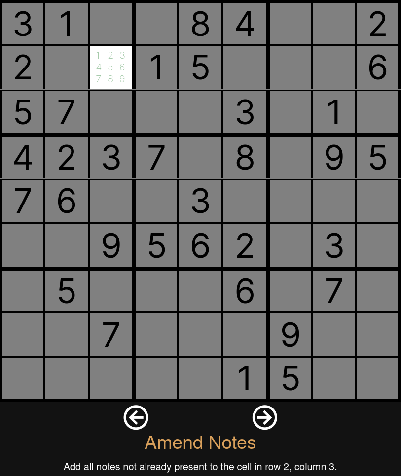
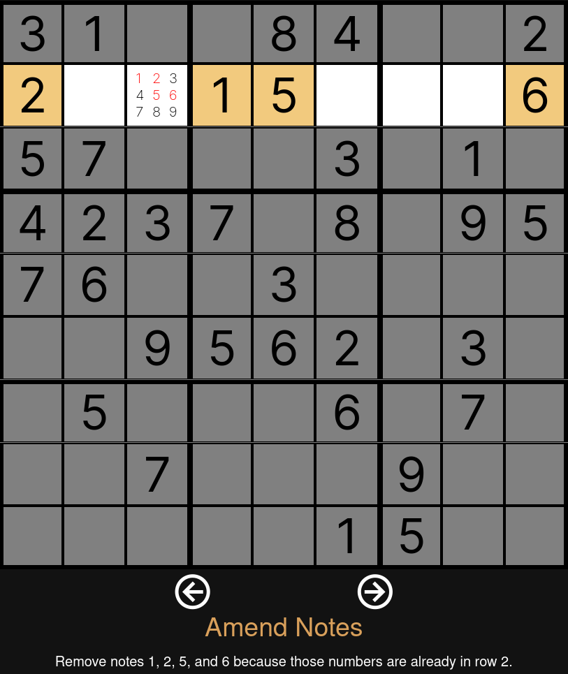
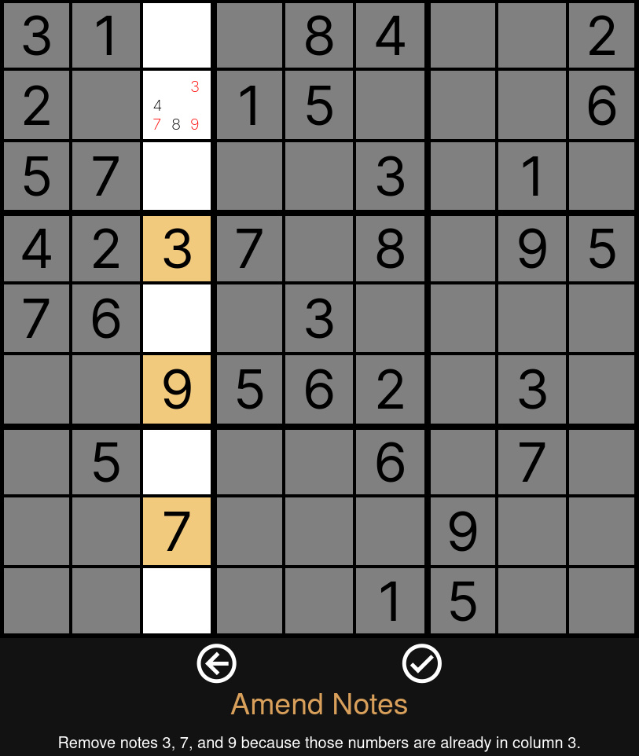
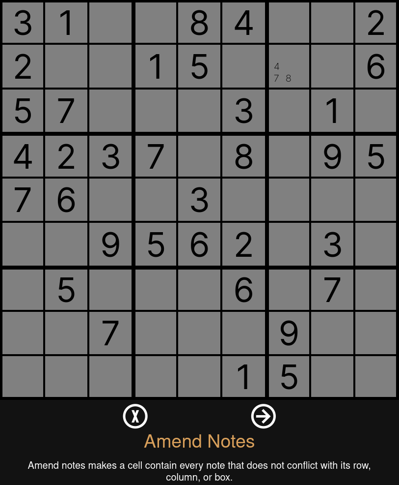
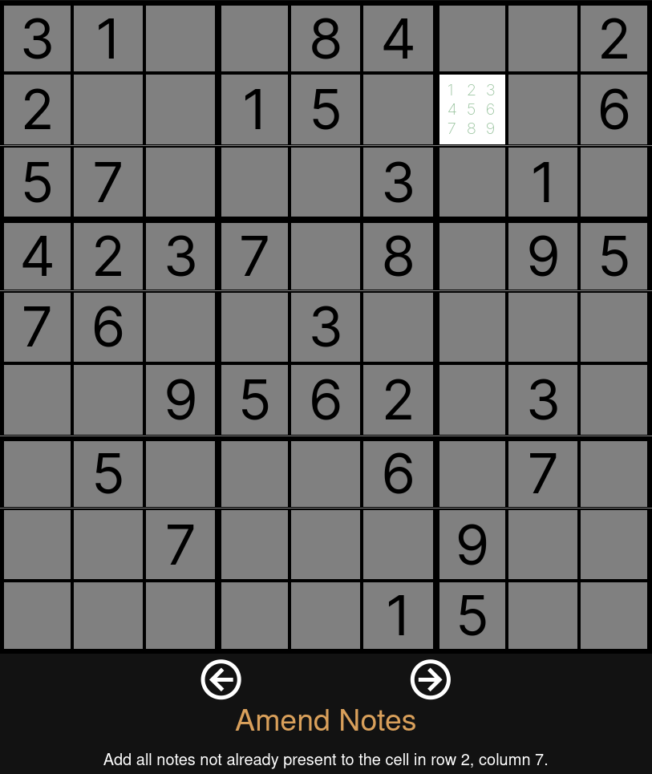
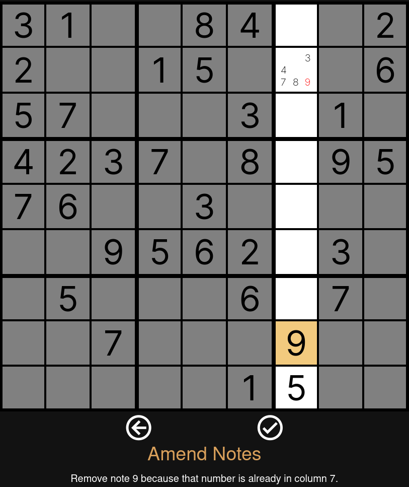

# Amend Notes Hint

This is the docs-first fixture for the V4 amend notes strategy. The strategy
adds all notes to the target cell, then removes the notes that conflict with
placed values in the same row, column, or box.

If the target already contains its solution note, the strategy returns `null`
and leaves the cell unchanged.

## Source Fixture

The examples use a standard 9x9 board from V4 test data:

- Source: `ADDITIONAL_TEST_BOARDS_BY_NAME.ONLY_OBVIOUS_SINGLES`

### Basic Amend Notes

- Target cell: `{ r: 1, c: 2 }`, which is row 2, column 3
- Starting notes: `[]`
- Amended notes: `[4, 8]`

### Filled-Cell Amend Notes

- Target cell: `{ r: 1, c: 6 }`, which is row 2, column 7
- Starting notes: `[4, 7, 8]`
- Amended notes: `[3, 4, 7, 8]`
- This example should be presented as ordinary amend-notes behavior; do not
  describe why the starting notes are incomplete or identify any solved value.

Cell locations use the V4 zero-indexed `{ r, c }` shape. User-facing text uses
one-indexed row and column labels.

## Frontend Demo

Demo PR: [Sudokuru/Frontend#394](https://github.com/Sudokuru/Frontend/pull/394)

That PR contains the Frontend demo for hints and includes a comment linking to the live dev site that hosts the demo.

## TypeScript Fixture

```ts
import type {
  CellLocation,
  Hint,
  HintStage,
  HighlightedCell,
  NoteCellWithLocation,
} from "../Types";

const basicTargetCell: NoteCellWithLocation = {
  r: 1,
  c: 2,
  type: "note",
  notes: [],
};

const basicAllNotesCell: NoteCellWithLocation = {
  r: 1,
  c: 2,
  type: "note",
  notes: [1, 2, 3, 4, 5, 6, 7, 8, 9],
};

const basicRowRemovalNotes: NoteCellWithLocation = {
  r: 1,
  c: 2,
  type: "note",
  notes: [1, 2, 5, 6],
};

const basicColumnRemovalNotes: NoteCellWithLocation = {
  r: 1,
  c: 2,
  type: "note",
  notes: [3, 7, 9],
};

const basicRowBasisCells: CellLocation[] = [
  { r: 1, c: 3 },
  { r: 1, c: 0 },
  { r: 1, c: 4 },
  { r: 1, c: 8 },
];

const basicColumnBasisCells: CellLocation[] = [
  { r: 3, c: 2 },
  { r: 7, c: 2 },
  { r: 5, c: 2 },
];

const filledTargetCell: NoteCellWithLocation = {
  r: 1,
  c: 6,
  type: "note",
  notes: [4, 7, 8],
};

const filledAllNotesCell: NoteCellWithLocation = {
  r: 1,
  c: 6,
  type: "note",
  notes: [1, 2, 3, 4, 5, 6, 7, 8, 9],
};

const filledRowRemovalNotes: NoteCellWithLocation = {
  r: 1,
  c: 6,
  type: "note",
  notes: [1, 2, 5, 6],
};

const filledColumnRemovalNotes: NoteCellWithLocation = {
  r: 1,
  c: 6,
  type: "note",
  notes: [9],
};

const filledRowBasisCells: CellLocation[] = [
  { r: 1, c: 3 },
  { r: 1, c: 0 },
  { r: 1, c: 4 },
  { r: 1, c: 8 },
];

const filledColumnBasisCells: CellLocation[] = [
  { r: 7, c: 6 },
];

type AmendNotesGroup = "row" | "column" | "box";

function sameLocation(a: CellLocation, b: CellLocation): boolean {
  return a.r === b.r && a.c === b.c;
}

function includesLocation(
  locations: CellLocation[],
  locationToFind: CellLocation
): boolean {
  return locations.some((location) =>
    sameLocation(location, locationToFind)
  );
}

function getAmendNotesGroupCells(
  target: CellLocation,
  group: AmendNotesGroup
): CellLocation[] {
  if (group === "row") {
    return Array.from({ length: 9 }, (_, c) => ({ r: target.r, c }));
  }

  if (group === "column") {
    return Array.from({ length: 9 }, (_, r) => ({ r, c: target.c }));
  }

  const boxTop = Math.floor(target.r / 3) * 3;
  const boxLeft = Math.floor(target.c / 3) * 3;

  return Array.from({ length: 9 }, (_, index) => ({
    r: boxTop + Math.floor(index / 3),
    c: boxLeft + (index % 3),
  }));
}

function getAmendNotesGroupFocusCells(
  target: CellLocation,
  group: AmendNotesGroup,
  basisCells: CellLocation[]
): HighlightedCell[] {
  return getAmendNotesGroupCells(target, group)
    .filter((location) => !sameLocation(location, target))
    .filter((location) => !includesLocation(basisCells, location))
    .map((location) => ({
      location,
      highlightType: "focus" as const,
    }));
}

const basicAmendNotesHintStages: HintStage[] = [
  {
    text: "Amend notes makes a cell contain every note that does not conflict with its row, column, or box.",
  },
  {
    placeNotes: [basicAllNotesCell],
    highlightCells: [
      { location: basicTargetCell, highlightType: "focus" },
    ],
    highlightNotes: basicAllNotesCell.notes.map((value) => ({
      location: basicTargetCell,
      value,
      highlightType: "placement" as const,
    })),
    text: "Add all notes not already present to the cell in row 2, column 3.",
  },
  {
    removeNotes: [basicRowRemovalNotes],
    highlightCells: [
      { location: basicTargetCell, highlightType: "focus" },
      ...getAmendNotesGroupFocusCells(
        basicTargetCell,
        "row",
        basicRowBasisCells
      ),
      ...basicRowBasisCells.map((location) => ({
        location,
        highlightType: "basis" as const,
      })),
    ],
    highlightNotes: basicRowRemovalNotes.notes.map((value) => ({
      location: basicTargetCell,
      value,
      highlightType: "removal" as const,
    })),
    text: "Remove notes 1, 2, 5, and 6 because those numbers are already in row 2.",
  },
  {
    removeNotes: [basicColumnRemovalNotes],
    highlightCells: [
      { location: basicTargetCell, highlightType: "focus" },
      ...getAmendNotesGroupFocusCells(
        basicTargetCell,
        "column",
        basicColumnBasisCells
      ),
      ...basicColumnBasisCells.map((location) => ({
        location,
        highlightType: "basis" as const,
      })),
    ],
    highlightNotes: basicColumnRemovalNotes.notes.map((value) => ({
      location: basicTargetCell,
      value,
      highlightType: "removal" as const,
    })),
    text: "Remove notes 3, 7, and 9 because those numbers are already in column 3.",
  },
];

const filledAmendNotesHintStages: HintStage[] = [
  {
    text: "Amend notes makes a cell contain every note that does not conflict with its row, column, or box.",
  },
  {
    placeNotes: [filledAllNotesCell],
    highlightCells: [
      { location: filledTargetCell, highlightType: "focus" },
    ],
    highlightNotes: filledAllNotesCell.notes.map((value) => ({
      location: filledTargetCell,
      value,
      highlightType: "placement" as const,
    })),
    text: "Add all notes not already present to the cell in row 2, column 7.",
  },
  {
    removeNotes: [filledRowRemovalNotes],
    highlightCells: [
      { location: filledTargetCell, highlightType: "focus" },
      ...getAmendNotesGroupFocusCells(
        filledTargetCell,
        "row",
        filledRowBasisCells
      ),
      ...filledRowBasisCells.map((location) => ({
        location,
        highlightType: "basis" as const,
      })),
    ],
    highlightNotes: filledRowRemovalNotes.notes.map((value) => ({
      location: filledTargetCell,
      value,
      highlightType: "removal" as const,
    })),
    text: "Remove notes 1, 2, 5, and 6 because those numbers are already in row 2.",
  },
  {
    removeNotes: [filledColumnRemovalNotes],
    highlightCells: [
      { location: filledTargetCell, highlightType: "focus" },
      ...getAmendNotesGroupFocusCells(
        filledTargetCell,
        "column",
        filledColumnBasisCells
      ),
      ...filledColumnBasisCells.map((location) => ({
        location,
        highlightType: "basis" as const,
      })),
    ],
    highlightNotes: filledColumnRemovalNotes.notes.map((value) => ({
      location: filledTargetCell,
      value,
      highlightType: "removal" as const,
    })),
    text: "Remove note 9 because that number is already in column 7.",
  },
];

export const basicAmendNotesHint: Hint = {
  strategy: "AMEND_NOTES",
  stages: basicAmendNotesHintStages,
};

export const filledAmendNotesHint: Hint = {
  strategy: "AMEND_NOTES",
  stages: filledAmendNotesHintStages,
};
```

## Expected Application

Applying the basic amend-notes hint should make exactly this note-cell change:

```ts
const basicBefore: NoteCellWithLocation = {
  r: 1,
  c: 2,
  type: "note",
  notes: [],
};

const basicAfter: NoteCellWithLocation = {
  r: 1,
  c: 2,
  type: "note",
  notes: [4, 8],
};
```

Applying the filled-cell amend-notes hint should make exactly this note-cell
change:

```ts
const filledBefore: NoteCellWithLocation = {
  r: 1,
  c: 6,
  type: "note",
  notes: [4, 7, 8],
};

const filledAfter: NoteCellWithLocation = {
  r: 1,
  c: 6,
  type: "note",
  notes: [3, 4, 7, 8],
};
```

Amend notes adds all notes to the target note cell, then removes row, column,
and box conflicts. Each removal stage highlights the target cell and the rest
of the row, column, or box being used as focus cells, except for cells already
highlighted as basis cells. It does not place a value. Omit any row, column, or
box stage that would not remove notes.

## Frontend Screenshots

Screenshots are saved under:

`V4/docs/screenshots/amend-notes/`

### Basic Amend Notes

Initial board before any amend-notes highlighting:


Stage 1 focuses the target cell and places notes 1 through 9:



Stage 2 highlights row focus cells, highlights the row basis cells, and removes
notes 1, 2, 5, and 6:



Stage 3 highlights column focus cells, highlights the column basis cells, and
removes notes 3, 7, and 9:



### Filled-Cell Amend Notes

Initial board before any amend-notes highlighting:



Stage 1 focuses the target cell and places notes 1 through 9:



Stage 2 highlights row focus cells, highlights the row basis cells, and removes
notes 1, 2, 5, and 6:


Stage 3 highlights column focus cells, highlights the column basis cell, and
removes note 9:


