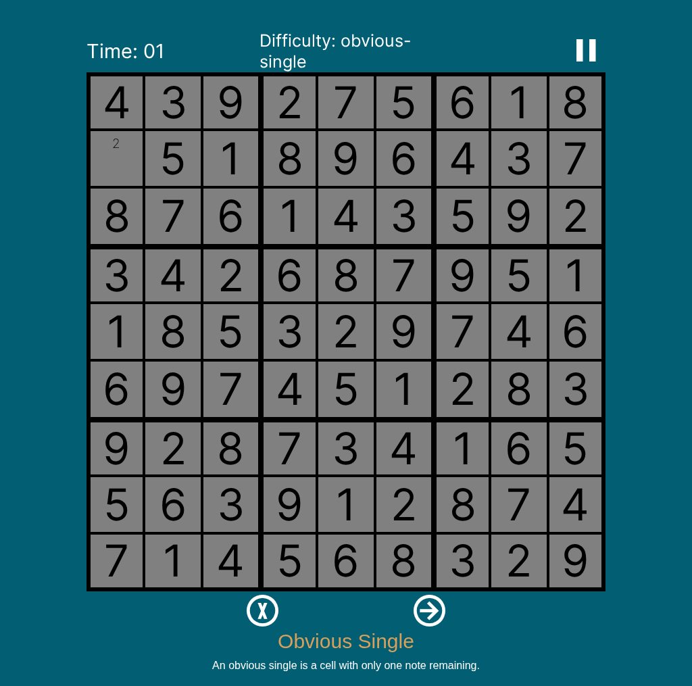
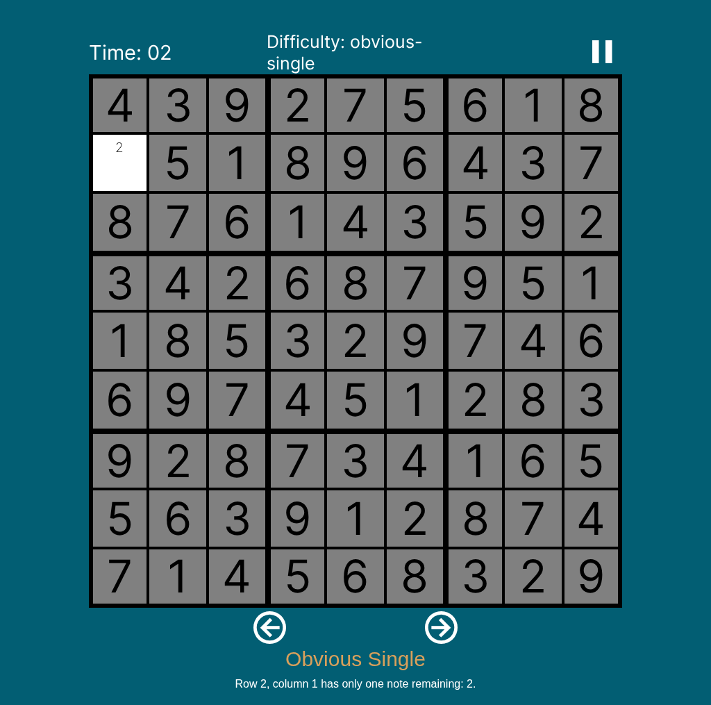
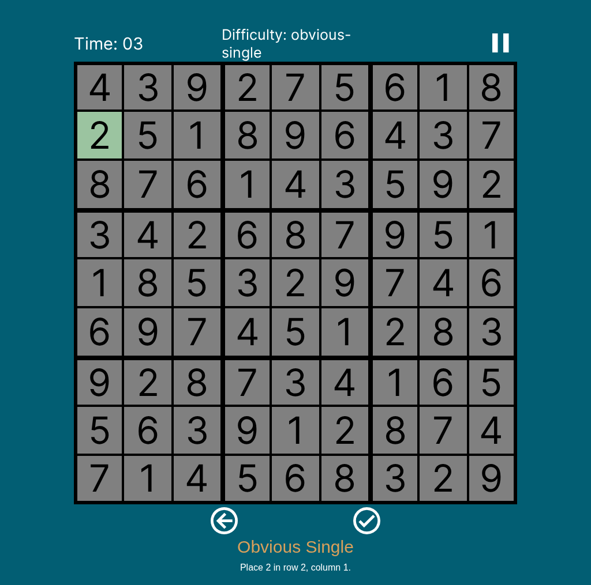
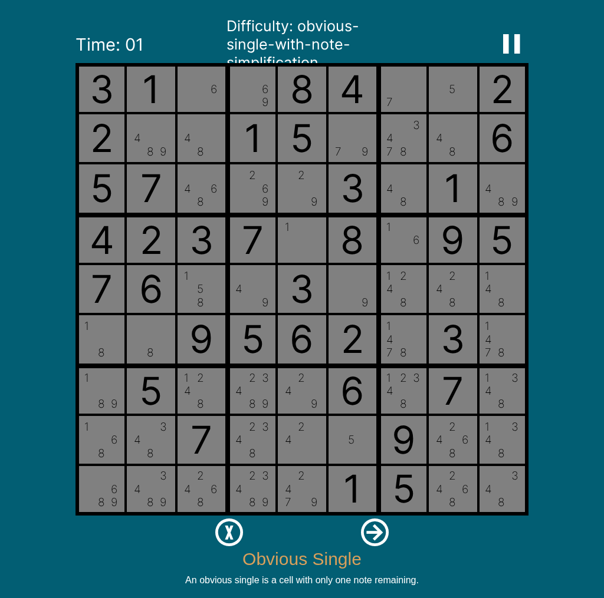
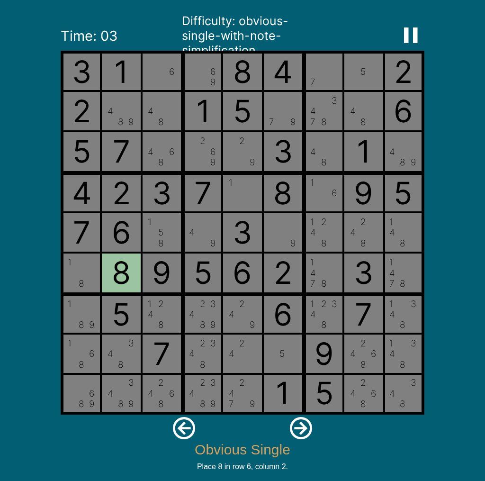
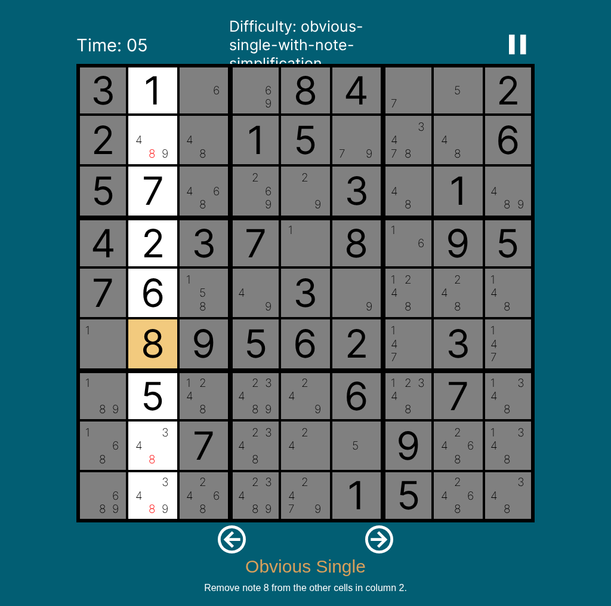

# Obvious Single Hint

This is the docs-first fixture for the V4 obvious single strategy. An obvious
single is an unresolved cell with exactly one candidate note remaining, so that
note can be placed as the cell's value.

## Source Fixtures

The examples use standard 9x9 boards from V4 test data.

### Placement Only

- Source: `ADDITIONAL_TEST_BOARDS_BY_NAME.SINGLE_OBVIOUS_SINGLE`
- Target cell: `{ r: 1, c: 0 }`, which is row 2, column 1
- Note cell used by the hint: `{ r: 1, c: 0, type: "note", notes: [2] }`
- Value placed by the hint: `{ r: 1, c: 0, type: "value", value: 2 }`

The source fixture has exactly one unresolved location. After its notes have
been prepared, the target contains only note `2`.

### Placement With Note Simplification

- Source: `ADDITIONAL_TEST_BOARDS_BY_NAME.ONLY_OBVIOUS_SINGLES`
- Target cell: `{ r: 5, c: 1 }`, which is row 6, column 2
- Note cell used by the hint: `{ r: 5, c: 1, type: "note", notes: [8] }`
- Value placed by the hint: `{ r: 5, c: 1, type: "value", value: 8 }`
- Row note removals: `{ r: 5, c: 0 }`, `{ r: 5, c: 6 }`, and
  `{ r: 5, c: 8 }`
- Column note removals: `{ r: 1, c: 1 }`, `{ r: 7, c: 1 }`, and
  `{ r: 8, c: 1 }`
- Box note removal: `{ r: 4, c: 2 }`

This example removes note `8` from three row cells, three column cells, and one
additional box cell after placing the obvious single. Cell locations use the
V4 zero-indexed `{ r, c }` shape. User-facing text uses one-indexed row and
column labels.

## Frontend Demo

Demo PR: [Sudokuru/Frontend#394](https://github.com/Sudokuru/Frontend/pull/394)

That PR contains the Frontend demo for hints and includes a comment linking to the live dev site that hosts the demo.

## TypeScript Fixture

```ts
import type {
  CellLocation,
  Hint,
  HintStage,
  HighlightedCell,
  NoteCellWithLocation,
  ValueCellWithLocation,
} from "../Types";

const obviousSingleNoteCell: NoteCellWithLocation = {
  r: 1,
  c: 0,
  type: "note",
  notes: [2],
};

const obviousSingleValueCell: ValueCellWithLocation = {
  r: 1,
  c: 0,
  type: "value",
  value: 2,
};

const simplifyingObviousSingleNoteCell: NoteCellWithLocation = {
  r: 5,
  c: 1,
  type: "note",
  notes: [8],
};

const simplifyingObviousSingleValueCell: ValueCellWithLocation = {
  r: 5,
  c: 1,
  type: "value",
  value: 8,
};

const simplifyingRowRemovalNotes: NoteCellWithLocation[] = [
  { r: 5, c: 0, type: "note", notes: [8] },
  { r: 5, c: 6, type: "note", notes: [8] },
  { r: 5, c: 8, type: "note", notes: [8] },
];

const simplifyingColumnRemovalNotes: NoteCellWithLocation[] = [
  { r: 1, c: 1, type: "note", notes: [8] },
  { r: 7, c: 1, type: "note", notes: [8] },
  { r: 8, c: 1, type: "note", notes: [8] },
];

const simplifyingBoxRemovalNotes: NoteCellWithLocation[] = [
  { r: 4, c: 2, type: "note", notes: [8] },
];

type ObviousSingleGroup = "row" | "column" | "box";

function getObviousSingleGroupCells(
  target: CellLocation,
  group: ObviousSingleGroup
): CellLocation[] {
  if (group === "row") {
    return Array.from({ length: 9 }, (_, c) => ({ r: target.r, c }));
  }

  if (group === "column") {
    return Array.from({ length: 9 }, (_, r) => ({ r, c: target.c }));
  }

  const boxTop = Math.floor(target.r / 3) * 3;
  const boxLeft = Math.floor(target.c / 3) * 3;

  return Array.from({ length: 9 }, (_, index) => ({
    r: boxTop + Math.floor(index / 3),
    c: boxLeft + (index % 3),
  }));
}

function getObviousSingleGroupHighlights(
  target: CellLocation,
  group: ObviousSingleGroup
): HighlightedCell[] {
  return [
    ...getObviousSingleGroupCells(target, group)
      .filter((location) =>
        location.r !== target.r || location.c !== target.c
      )
      .map((location) => ({
        location,
        highlightType: "focus" as const,
      })),
    { location: target, highlightType: "basis" },
  ];
}

const obviousSingleHintStages: HintStage[] = [
  {
    text: "An obvious single is a cell with only one note remaining.",
  },
  {
    highlightCells: [
      { location: obviousSingleNoteCell, highlightType: "focus" },
    ],
    text: "Row 2, column 1 has only one note remaining: 2.",
  },
  {
    placeValues: [obviousSingleValueCell],
    highlightCells: [
      { location: obviousSingleValueCell, highlightType: "placement" },
    ],
    text: "Place 2 in row 2, column 1.",
  },
];

const simplifyingObviousSingleHintStages: HintStage[] = [
  {
    text: "An obvious single is a cell with only one note remaining.",
  },
  {
    highlightCells: [
      {
        location: simplifyingObviousSingleNoteCell,
        highlightType: "focus",
      },
    ],
    text: "Row 6, column 2 has only one note remaining: 8.",
  },
  {
    placeValues: [simplifyingObviousSingleValueCell],
    highlightCells: [
      {
        location: simplifyingObviousSingleValueCell,
        highlightType: "placement",
      },
    ],
    text: "Place 8 in row 6, column 2.",
  },
  {
    removeNotes: simplifyingRowRemovalNotes,
    highlightCells: getObviousSingleGroupHighlights(
      simplifyingObviousSingleValueCell,
      "row"
    ),
    highlightNotes: simplifyingRowRemovalNotes.map(({ r, c }) => ({
      location: { r, c },
      value: 8,
      highlightType: "removal" as const,
    })),
    text: "Remove note 8 from the other cells in row 6.",
  },
  {
    removeNotes: simplifyingColumnRemovalNotes,
    highlightCells: getObviousSingleGroupHighlights(
      simplifyingObviousSingleValueCell,
      "column"
    ),
    highlightNotes: simplifyingColumnRemovalNotes.map(({ r, c }) => ({
      location: { r, c },
      value: 8,
      highlightType: "removal" as const,
    })),
    text: "Remove note 8 from the other cells in column 2.",
  },
  {
    removeNotes: simplifyingBoxRemovalNotes,
    highlightCells: getObviousSingleGroupHighlights(
      simplifyingObviousSingleValueCell,
      "box"
    ),
    highlightNotes: simplifyingBoxRemovalNotes.map(({ r, c }) => ({
      location: { r, c },
      value: 8,
      highlightType: "removal" as const,
    })),
    text: "Remove note 8 from the other cells in the same box.",
  },
];

export const obviousSingleHint: Hint = {
  strategy: "OBVIOUS_SINGLE",
  stages: obviousSingleHintStages,
};

export const simplifyingObviousSingleHint: Hint = {
  strategy: "OBVIOUS_SINGLE",
  stages: simplifyingObviousSingleHintStages,
};
```

## Expected Application

Applying the hint should make exactly this cell change:

```ts
const before: NoteCellWithLocation = {
  r: 1,
  c: 0,
  type: "note",
  notes: [2],
};

const after: ValueCellWithLocation = {
  r: 1,
  c: 0,
  type: "value",
  value: 2,
};
```

The application replaces the target note cell with the placed value. It should
not change any other cell.

Applying the obvious-single hint with note simplification should make exactly
these cell changes:

```ts
const simplifyingBefore: NoteCellWithLocation[] = [
  { r: 5, c: 1, type: "note", notes: [8] },
  { r: 5, c: 0, type: "note", notes: [1, 8] },
  { r: 5, c: 6, type: "note", notes: [1, 4, 7, 8] },
  { r: 5, c: 8, type: "note", notes: [1, 4, 7, 8] },
  { r: 1, c: 1, type: "note", notes: [4, 8, 9] },
  { r: 7, c: 1, type: "note", notes: [3, 4, 8] },
  { r: 8, c: 1, type: "note", notes: [3, 4, 8, 9] },
  { r: 4, c: 2, type: "note", notes: [1, 5, 8] },
];

const simplifyingAfter: Array<
  ValueCellWithLocation | NoteCellWithLocation
> = [
  { r: 5, c: 1, type: "value", value: 8 },
  { r: 5, c: 0, type: "note", notes: [1] },
  { r: 5, c: 6, type: "note", notes: [1, 4, 7] },
  { r: 5, c: 8, type: "note", notes: [1, 4, 7] },
  { r: 1, c: 1, type: "note", notes: [4, 9] },
  { r: 7, c: 1, type: "note", notes: [3, 4] },
  { r: 8, c: 1, type: "note", notes: [3, 4, 9] },
  { r: 4, c: 2, type: "note", notes: [1, 5] },
];
```

After placing the value, note simplification stages must be emitted in row,
column, then box order. Omit a row, column, or box stage when that group has no
notes to remove. A note removed in an earlier group stage must not be removed
again in a later overlapping group stage. This example exercises all three
groups.

## Frontend Screenshots

Screenshots are saved under:

`V4/docs/screenshots/obvious-single/`

### Placement Only

Stage 1 shows the strategy overview without highlights:



Stage 2 focuses the target cell:



Stage 3 places `2` in the target cell:



### Placement With Note Simplification

Stage 1 shows the strategy overview without highlights:



Stage 2 focuses the target cell:


Stage 3 places `8` in the target cell:



Stage 4 simplifies note `8` from row 6:


Stage 5 simplifies note `8` from column 2:



Stage 6 simplifies note `8` from the box:


