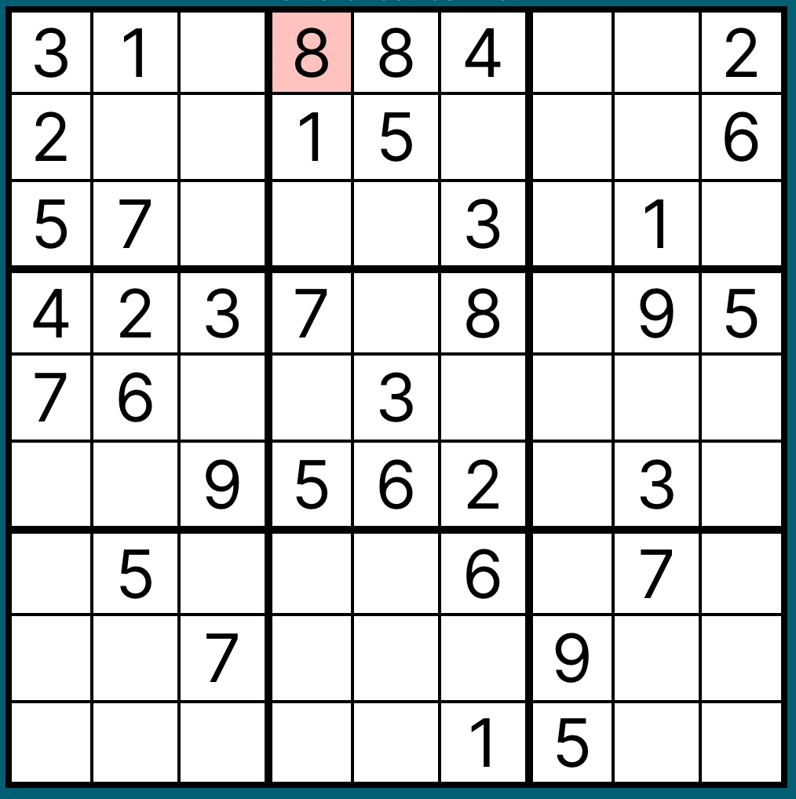
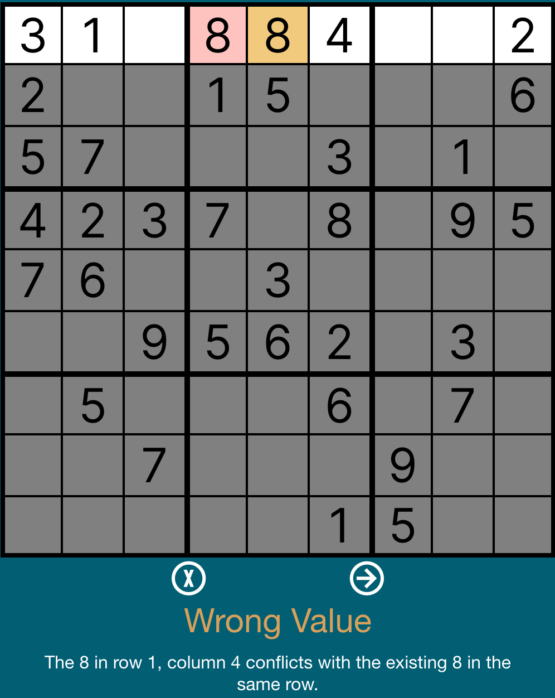
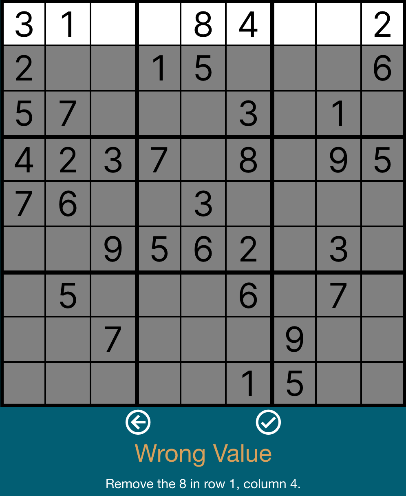
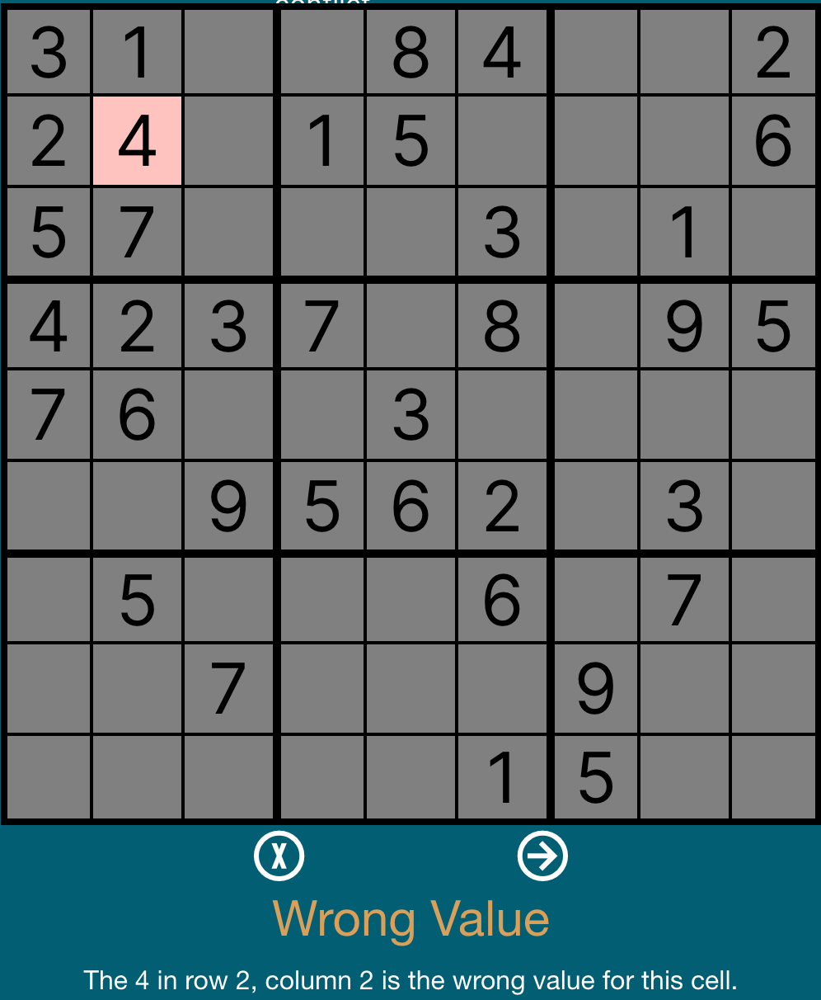
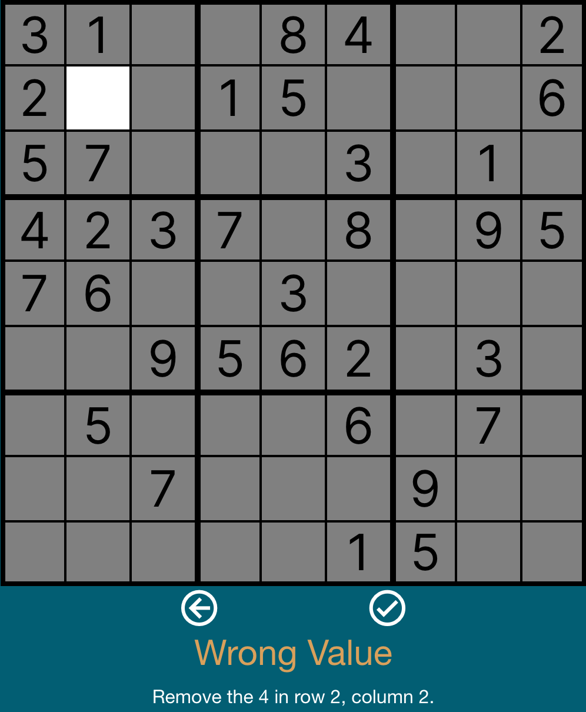

# Wrong Value Hint

This is the docs-first fixture for the V4 wrong value strategy. The
strategy should identify a value that contradicts the puzzle
state and return a staged hint that the Frontend can render directly.

## Source Fixture

The examples use a standard 9x9 board from V4 test data:

- Source: `ADDITIONAL_TEST_BOARDS_BY_NAME.ONLY_OBVIOUS_SINGLES`

### Direct Row Conflict

- User mistake: place `8` at `{ r: 0, c: 3 }`, which is row 1, column 4
- Obvious conflict: the given `8` at `{ r: 0, c: 4 }`, in the same row

### No Direct Conflict

- User mistake: place `4` at `{ r: 1, c: 1 }`, which is row 2, column 2
- No givens conflict: `4` is not currently present in that cell's row, column, or box
- Verified against `ADDITIONAL_TEST_BOARDS_BY_NAME.ONLY_OBVIOUS_SINGLES_SOLUTION`; the correct value is intentionally omitted from this doc and hint text

Cell locations use the V4 zero-indexed `{ r, c }` shape. User-facing text
uses one-indexed row and column labels.

## Frontend Demo

Demo PR: [Sudokuru/Frontend#394](https://github.com/Sudokuru/Frontend/pull/394)

That PR contains the Frontend demo for these wrong value hints and includes a
comment linking to the live dev site that hosts the demo.

## TypeScript Fixture

```ts
import type {
  CellLocation,
  Hint,
  HintStage,
  ValueCellWithLocation,
} from "../Types";

const directConflictWrongValue: ValueCellWithLocation = {
  r: 0,
  c: 3,
  type: "value",
  value: 8,
};

const conflictingGiven: ValueCellWithLocation = {
  r: 0,
  c: 4,
  type: "given",
  value: 8,
};

const noDirectConflictWrongValue: ValueCellWithLocation = {
  r: 1,
  c: 1,
  type: "value",
  value: 4,
};

const directConflictRowFocusCells: CellLocation[] = [
  { r: 0, c: 0 },
  { r: 0, c: 1 },
  { r: 0, c: 2 },
  { r: 0, c: 5 },
  { r: 0, c: 6 },
  { r: 0, c: 7 },
  { r: 0, c: 8 },
];

const directConflictFullRowFocusCells: CellLocation[] = [
  { r: 0, c: 0 },
  { r: 0, c: 1 },
  { r: 0, c: 2 },
  { r: 0, c: 3 },
  { r: 0, c: 4 },
  { r: 0, c: 5 },
  { r: 0, c: 6 },
  { r: 0, c: 7 },
  { r: 0, c: 8 },
];

const directConflictWrongValueHintStages: HintStage[] = [
  {
    highlightCells: [
      ...directConflictRowFocusCells.map((location) => ({
        location,
        highlightType: "focus" as const,
      })),
      { location: directConflictWrongValue, highlightType: "removal" },
      { location: conflictingGiven, highlightType: "basis" },
    ],
    text:
      "The 8 in row 1, column 4 conflicts with the existing 8 in the same row.",
  },
  {
    removeValues: [directConflictWrongValue],
    highlightCells: [
      ...directConflictFullRowFocusCells.map((location) => ({
        location,
        highlightType: "focus" as const,
      })),
    ],
    text: "Remove the 8 in row 1, column 4.",
  },
];

const noDirectConflictWrongValueHintStages: HintStage[] = [
  {
    highlightCells: [
      { location: noDirectConflictWrongValue, highlightType: "removal" },
    ],
    text: "The 4 in row 2, column 2 is the wrong value for this cell.",
  },
  {
    removeValues: [noDirectConflictWrongValue],
    highlightCells: [
      { location: noDirectConflictWrongValue, highlightType: "focus" },
    ],
    text: "Remove the 4 in row 2, column 2.",
  },
];

export const directConflictWrongValueHint: Hint = {
  strategy: "WRONG_VALUE",
  stages: directConflictWrongValueHintStages,
};

export const noDirectConflictWrongValueHint: Hint = {
  strategy: "WRONG_VALUE",
  stages: noDirectConflictWrongValueHintStages,
};
```

## Expected Application

Applying either hint should make exactly one board change:

```ts
const directConflictBefore: ValueCellWithLocation = {
  r: 0,
  c: 3,
  type: "value",
  value: 8,
};

const directConflictAfter: NoteCellWithLocation = {
  r: 0,
  c: 3,
  type: "note",
  notes: [],
};

const noDirectConflictBefore: ValueCellWithLocation = {
  r: 1,
  c: 1,
  type: "value",
  value: 4,
};

const noDirectConflictAfter: NoteCellWithLocation = {
  r: 1,
  c: 1,
  type: "note",
  notes: [],
};
```

Removing the value from a cell that was empty before the user move should
restore that location to an unresolved empty cell. It should not place notes or
reveal the correct value. The wrong value strategy is a correction hint, not a
solving hint.

## Frontend Screenshots

Screenshots are saved under:

`V4/docs/screenshots/wrong-values/`

### Direct Row Conflict

Initial board with the wrong `8` in row 1, column 4:



Stage 1 highlights the first row as focus, the wrong `8` for removal, and the
existing `8` as basis:



Stage 2 removes the `8`:



### No Direct Conflict

Initial board with the wrong `4` in row 2, column 2:


Stage 1 highlights the wrong `4` without highlighting another conflicting cell:



Stage 2 removes the `4`:


